# Step_Coming

This document illustrates the algorithm executed in the first part of a simulated step in the $O(n \lg n)$ simulation.

Start: the head $a$ scans down the tape looking for a non-empty zone.

$$
\begin{align*}
    \delta(q_{?};Z_{0},\gamma_1,\gamma_2)
    &=(q_s;Z_{0},\gamma_1,\gamma_2;C,N) \\
    \delta(q_s;B,\gamma_1,\gamma_2)
    &=(q_s;B,\gamma_1,\gamma_2;C,N) \\
    \delta(q_s;Z_{u,e},\gamma_1,\gamma_2)
    &=(q_s;Z_{u,e},\gamma_1,\gamma_2;C,N) \\
    \delta(q_s;Z_{l},\gamma_1,\gamma_2)
    &=(q_s;Z_{l},\gamma_1,\gamma_2;C,N)
\end{align*}
$$

Part 0: Update $C_{2,u}$ to remove half its capacity, and continue scanning down.
$$
\begin{align*}
    \delta(q_s;Z_{u,f},\gamma_1,\gamma_2)
    &=(q_0;Z_{u,h},\gamma_1,\gamma_2;C,N) \\
    \delta(q_s;Z_{u,h},\gamma_1,\gamma_2)
    &=(q_0;Z_{u,e},\gamma_1,\gamma_2;C,N)
\end{align*}
$$

```mermaid
block-beta
    columns 14
    space:5
    a(("a"))
    a0(("a0"))
    space:7
    c0l["C0l"]
    c1u["C1u"]
    space
    c1l["C1l"]
    space
    c2u["C2u"]
    space:3
    c2l["C2l"]
    space:3
    c3u["C3u"]
    block:d0l:1
        c0n1[" "]
    end
    block:d1u:2
        d1n0[" "]
        d1n1[" "]
    end
    block:d1l:2
        d1n2[" "]
        d1n3[" "]
    end
    block:d2u:4
        d2n0["a"]
        d2n1["b"]
        d2n2["c"]
        d2n3["d"]
    end
    block:d2l:4
        d2n4["e"]
        d2n5["f"]
        d2n6["g"]
        d2n7["h"]
    end
    block:d3u:1
        d3n0["t"]
    end

    s0[" "]
    s1[" "]
    s2[" "]
    s3[" "]
    s4[" "]
    s5[" "]
    space:8

    space
    b0(("b0"))

    a-.->a0
    a-->c2u
    a0-->d2n1
    b0-->s1
```

Part 1: Scan $a$ down to $C_{2,l}$.
$$
\begin{align*}
    \delta(q_0;B,\gamma_1,\gamma_2)
    &=(q_0;B,\gamma_1,\gamma_2;C,N)
\end{align*}
$$

Part 2: Move data in $C_{2,l}$ inclusive through $C_{3,u}$ exclusive to scratch.
$$
\begin{align*}
    \delta(q_0;Z_l,\gamma_1,\gamma_2)
    &=(q_1;Z_l,B,\gamma_1;C,R) \\
    \delta(q_1;B,\gamma_1,\gamma_2)
    &=(q_1;B,B,\gamma_1;C,R)
\end{align*}
$$

Part 3: Recover $a$ back to $C_{2,l}$.
$$
\begin{align*}
    \delta(q_1;Z_{u,e/h/f},\gamma_1,\gamma_2)
    &=(q_2;Z_{u,e/h/f},\gamma_1,\gamma_2;G,N) \\
    \delta(q_2;B,\gamma_1,\gamma_2)
    &=(q_2;B,\gamma_1,\gamma_2;G,N)
\end{align*}
$$

Part 4: Step $a$ and $b$ back once.
$$
\begin{align*}
    \delta(q_2;Z_{l},\gamma_1,\gamma_2)
    &=(q_3;Z_{l},\gamma_1,\gamma_2;G,L)
\end{align*}
$$

Part 5: Swap through $C_{2,u}$.
$$
\begin{align*}
    \delta(q_3;B,\gamma_1,\gamma_2)
    &=(q_3;B,\gamma_2,\gamma_1;G,L)
\end{align*}
$$

Part 6: Swap once, stepping up on $a$, but no-move on $b$.
$$
\begin{align*}
    \delta(q_3;Z_{u,e/h/f},\gamma_1,\gamma_2)
    &=(q_4;Z_{u,e/h/f},\gamma_2,\gamma_1;G,N)
\end{align*}
$$

Part 7: Scan $a$ back to $C_{1,u}$. If instead $C_Z$ is detected, transition to next segment of the algorithm
$$
\begin{align*}
    \delta(q_4;B,\gamma_1,\gamma_2)
    &=(q_4;B,\gamma_1,\gamma_2;G,N) \\
    \delta(q_4;Z_l,\gamma_1,\gamma_2)
    &=(q_4;Z_l,\gamma_1,\gamma_2;G,N) \\
    \delta(q_4;Z_0,\gamma_1,\gamma_2)
    &=\dots
\end{align*}
$$

Part 8: Move data from $C_{1,u}$ inclusive through $C_{2,u}$ exclusive from scratch tape back to the main tape, simultaneously updating $C_{1,u}$.
$$
\begin{align*}
    \delta(q_4;Z_{u,e},\gamma_1,\gamma_2)
    &=(q_5;Z_{u,f},\gamma_2,B;C,R) \\
    \delta(q_5;B,\gamma_1,\gamma_2)
    &=(q_{5};B,\gamma_2,B;G,N) \\
    \delta(q_5;Z_l,\gamma_1,\gamma_2)
    &=(q_{5};Z_l,\gamma_2,B;G,N)
\end{align*}
$$

Part 9: Recover back to $C_{1,u}$
$$
\begin{align*}
    \delta(q_5;Z_{u,e/h},\gamma_1,\gamma_2)
    &=(q_6;Z_{u,e/h},\gamma_1,\gamma_2;G,L) \\
    \delta(q_6;B,\gamma_1,\gamma_2)
    &=(q_{6};B,\gamma_1,\gamma_2;G,L) \\
    \delta(q_6;Z_l,\gamma_1,\gamma_2)
    &=(q_{6};Z_l,\gamma_1,\gamma_2;G,L)
\end{align*}
$$

Part 10: Recurse back to Part 0.
$$
\begin{align*}
    \delta(q_6;Z_{u,f},\gamma_1,\gamma_2)
    &=(q_0;Z_{u,h},\gamma_1,\gamma_2;C,N)
\end{align*}
$$

