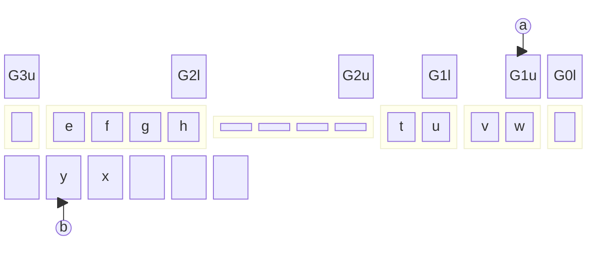
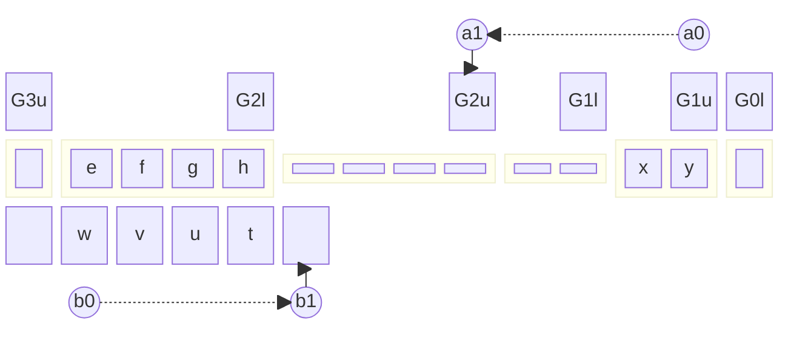
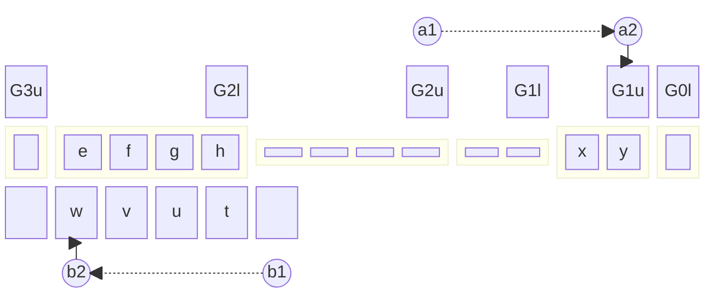

Start: $a$ is at $G_{1,u}$, and $b$ is at start of scratch containing half-zone data.

Step 1: Swap data in $G_{1,u}$ inclusive through $G_{2,u}$ exclusive.
$$
\begin{align*}
    \delta(q_s;Z_{u,e/h/f},\gamma_1,\gamma_2)
    &=(q_1;Z_{u,e/h/f},\gamma_2,\gamma_1;G,R) \\
    \delta(q_1;B,\gamma_1,\gamma_2)
    &=(q_1;B,\gamma_2,\gamma_1;G,R) \\
    \delta(q_1;Z_l,\gamma_1,\gamma_2)
    &=(q_1;Z_l,\gamma_2,\gamma_1;G,R)
\end{align*}
$$

Step 2: Move back to $G_{1,u}$ while moving $b$ back.
$$
\begin{align*}
    \delta(q_1;Z_{u,e/h/f},\gamma_1,\gamma_2)
    &=(q_2;Z_{u,e/h/f},\gamma_1,\gamma_2;C,L) \\
    \delta(q_2;B,\gamma_1,\gamma_2)
    &=(q_2;B,\gamma_2,\gamma_1;C,L) \\
    \delta(q_2;Z_l,\gamma_1,\gamma_2)
    &=(q_2;Z_l,\gamma_2,\gamma_1;C,L)
\end{align*}
$$

Step 3a: If $G_1$ was empty, update usage and move on to the next segment of the algorithm; typically recovery to $Z_0$.
$$
\begin{align*}
    \delta(q_2;Z_{u,e},\gamma_1,\gamma_2)
    &=(q_r;Z_{u,h},\gamma_1,\gamma_2;C,N)
\end{align*}
$$

Step 3b: If $G_1$ was half-empty, update usage, scan to $G_{1,l}$, swap to $G_{2,u}$, then move on to recovery.
$$
\begin{align*}
    \delta(q_2;Z_{u,h},\gamma_1,\gamma_2)
    &=(q_3;Z_{u,f},\gamma_1,\gamma_2;G,N) \\
    \delta(q_3;B,\gamma_1,\gamma_2)
    &=(q_3;B,\gamma_1,\gamma_2;G,N)
\end{align*}
$$

Step 4b: Move data from scratch from $G_{1,l}$ inclusive to $G_{2,u}$ exclusive.
$$
\begin{align*}
    \delta(q_3;Z_l,\gamma_1,\gamma_2)
    &=(q_4;Z_l,\gamma_2,B;G,R) \\
    \delta(q_4;B,\gamma_1,\gamma_2)
    &=(q_4;B,\gamma_2,B;G,R)
\end{align*}
$$

Step 5b: Recover to $G_{1,l}$ while moving $b$ back.
$$
\begin{align*}
    \delta(q_4;Z_{u,e/h/f},\gamma_1,\gamma_2)
    &=(q_5;Z_{u,e/h/f},\gamma_1,\gamma_2;C,L) \\
    \delta(q_5;B,\gamma_1,\gamma_2)
    &=(q_5;B,\gamma_1,\gamma_2;C,L) \\
    \delta(q_5;Z_l,\gamma_1,\gamma_2)
    &=(q_r;Z_l,\gamma_1,\gamma_2;C,N)
\end{align*}
$$

Step 3c: If $G_1$ was full, update usage, scan to $G_{2,u}$, and recurse.
$$
\begin{align*}
    \delta(q_2;Z_{u,f},\gamma_1,\gamma_2)
    &=(q_6;Z_{u,h},\gamma_1,\gamma_2;G,N) \\
    \delta(q_6;B,\gamma_1,\gamma_2)
    &=(q_6;B,\gamma_1,\gamma_2;G,N) \\
    \delta(q_6;Z_l,\gamma_1,\gamma_2)
    &=(q_6;Z_l,\gamma_1,\gamma_2;G,N) \\
    \delta(q_6;Z_{u,e/h/f},\gamma_1,\gamma_2)
    &=(q_1;Z_{u,e/h/f},\gamma_2,\gamma_1;G,R)
\end{align*}
$$

Step recovery: We list the rules that recover the head to $Z_0$
$$
\begin{align*}
    \delta(q_r;Z_0,\gamma_1,\gamma_2)
    &=\dots \\
    \delta(q_r;B,\gamma_1,\gamma_2)
    &=(q_r;B,\gamma_1,\gamma_2;C,N) \\
    \delta(q_2;Z_{u,e/h/f},\gamma_1,\gamma_2)
    &=(q_2;Z_{u,e/h/f},\gamma_1,\gamma_2;C,L) \\
    \delta(q_r;Z_l,\gamma_1,\gamma_2)
    &=(q_r;Z_l,\gamma_1,\gamma_2;C,N)
\end{align*}
$$

