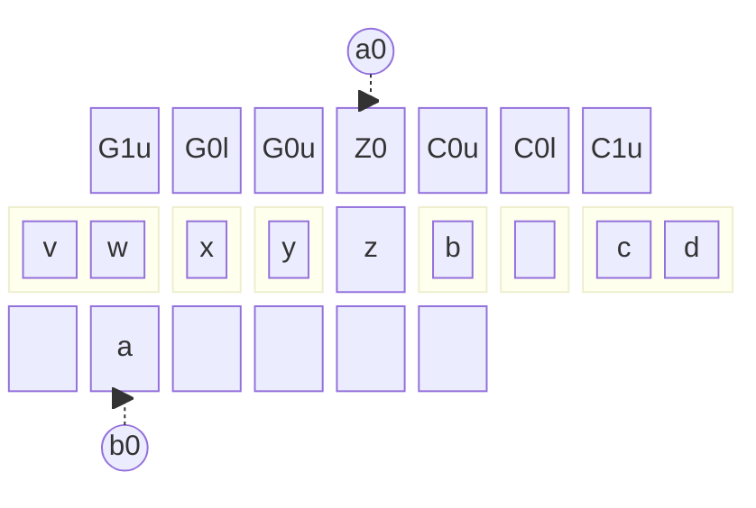

# Step_Head

This document illustrates the algorithm executed in the middle part of a simulated step in the $O(n \lg n)$ simulation.

Start: $a$ is at $Z_0$ that contains the newly overprinted symbol (wrt the simulated machine), and the scratch tape contains a single cell of data.

Part 0: Perform a swap while moving $a$ down. This is the only step.
$$
\begin{align*}
    \delta(q_s;Z_0,\gamma_1,\gamma_2)
    &=(q_h;Z_0,\gamma_2,\gamma_1;G,N)
\end{align*}
$$